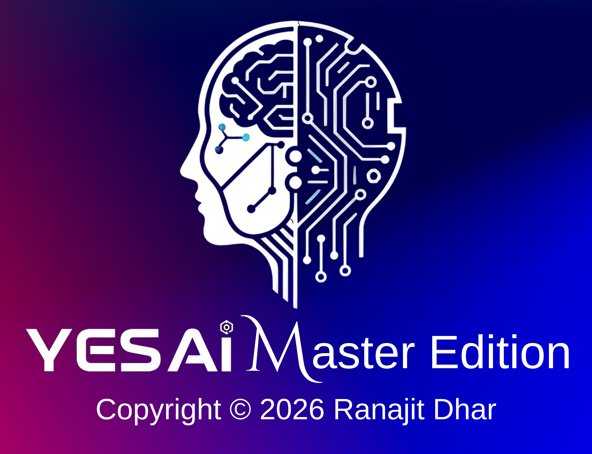
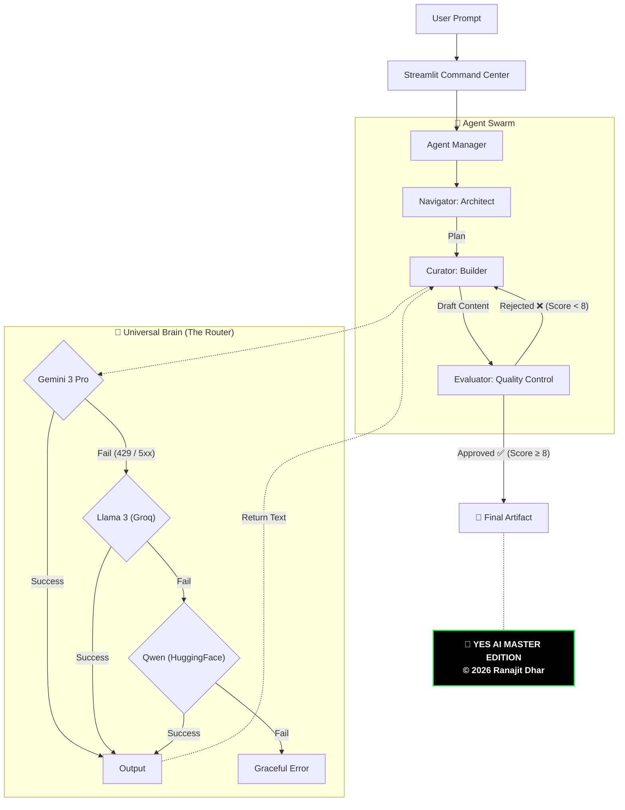
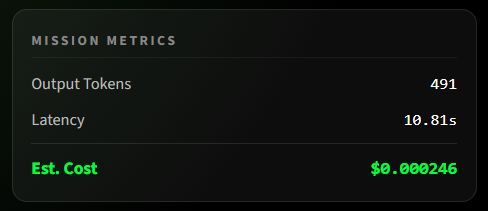
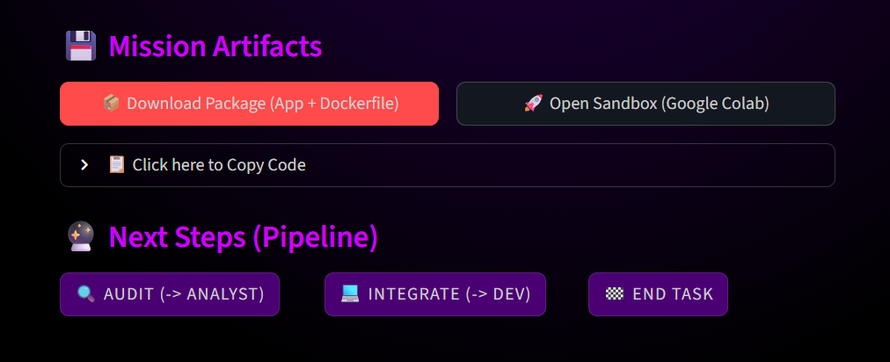

<table width="100%">
  <tr>
    <td width="20%" align="center">
      
    </td>
    <td width="80%" align="left">
      <h1 style="border-bottom: none; margin-bottom: 0;">🧠 YES AI MASTER EDITION</h1>
      <h3>The Unified End-to-End Autonomous Workforce | Engineered by a Solo Developer</h3>
      <p>
        
        
        <br>
        
        <a href="YOUR_STREAMLIT_APP_URL_HERE" target="_blank">
  
</a>
      </p>
    </td>
  </tr>
</table>

---

## 🚀 What is YES AI Master Edition?

**YES AI Master Edition is not a chatbot.**

It is a **multi‑agent, multi‑brain, self‑healing, auto‑failover AI operating system** designed to think, recover, explain itself, and adapt in real‑time. Unlike traditional wrappers that crash when an API fails, YES AI is built to survive.

> **At its core, YES AI Master Edition is architected around Gemini 3 as its primary reasoning and orchestration engine.**

> ❝ One prompt in. A coordinated AI workforce out. ❞


> ## ⚡ Judge TL;DR (30-Second Overview)
>
> * 🧠 **Not a Chatbot** — A multi-agent AI operating system.
> * 🔄 **Self-Healing by Design** — Auto-retry & evaluator loops.
> * 🛡️ **Unbreakable AI** — Gemini-first reasoning with intelligent auto-failover (Llama → Qwen).
> * 🔮 **Unified Pipeline** — Chain Dev, Analyst, Creator & Sentinel modes.
> * 🧬 **Quantum-Ready** — Sentinel Mode generates Kyber-1024 safe keys.
> * 📊 **Glass-Box Observability** — Live "Brain View", Real-time Cost & Token tracking.

---

## 🔥 Core Philosophy (Why This Exists)

We moved beyond simple wrappers to build a resilient system.

| Traditional AI Wrappers ❌ | 🧠 YES AI Master Edition ✅ |
| :--- | :--- |
| **Single Model Dependency** | **Multi‑Brain Orchestration** (Gemini → Llama → Qwen) |
| **Silent Failures** (Crash on 429 / 5xx) | **Transparent Failover Logs** & Circuit Breakers |
| **Black‑box Output** | **Self‑Explaining Decisions** (Live "Brain View") |
| **Stateless / Forgetful** | **Consent-Based Memory** & Context Awareness |
| **Fragile Execution** | **Self‑Healing + Auto‑Retry Loops** |

---

## 🛡️ The "Unbreakable" Logic: Auto‑Failover Intelligence

Most AI tools stop working when they hit an API Quota error. **YES Ai gets smarter.**
*Gemini 3 remains the system’s cognitive core; failover models exist solely to preserve continuity, not to replace intelligence depth.*

### 💡 The Real-World Scenario
**🚫 The Old Way:**
> *User is working on a critical demo.*
> **AI:** "Error 429: Resource has been exhausted."
> **Result:** ❌ **CRASH.** The demo fails, and the user is stuck.

**✅ The YES Ai Way:**
> *User is working on the same demo.*
> **Gemini 3 Pro:** "Error 429: Quota Exceeded."
> **YES Ai Brain:** ⚠️ *"Primary Brain failed. Engaging Backup Circuit."*
> **Llama 3 (Groq):** *"I have taken over the request. Processing..."*
> **Result:** 🚀 **SUCCESS.** The user never noticed the failure.

### 🧠 How the Circuit Breaker Works
* **Primary Brain:** 🟢 `Gemini 3 Pro` (Planning, Reasoning, Reflection)
* **Continuity Brain:** 🟡 `Llama 3 on Groq` (Low-latency failover)
* **Survival Brain:** 🔴 `Qwen / Phi` (Emergency Fallback)

**Logic:** If Gemini fails repeatedly, the system triggers the **Circuit Breaker**, silently disabling the faulty model and routing all traffic to Llama 3. **Zero user interruption.**


## 🧬 High-Level Architecture

The system uses a **Universal Brain Router** to ensure 100% uptime.

---

## 🎛️ Operation Modes (Personas)

YES Ai adapts its personality and tools based on the selected mode:

### 🧑‍💻 DEV MODE (Matrix Green Theme)
* **Role:** Senior Technical Architect.
* **Capabilities:** Generates monolithic, self-contained Python scripts.
* **Self-Repair:** Includes an **Auto-Debug Loop** to identify and patch logic errors before output. 🛠️
* **Validation:** Auto-appends `Dockerfile` for immediate deployment.
* **X-Factor:** Produces **Production-Ready Code**, not just snippets.

### 🎨 CREATOR MODE (Neon Pink Theme)
* **Role:** Viral Content Strategist.
* **Capabilities:** Writes engaging blogs, scripts, and posts.
* **Validation:** Auto-generates a **Social Media Pack** (Captions + 30 Viral Hashtags).
* **X-Factor:** Ready to copy-paste directly to LinkedIn/YouTube.

### 📊 ANALYST MODE (Deep Cyan Theme)
* **Role:** Lead Researcher & Data Scientist.
* **Capabilities:** Performs **Live Web Search** via SERPAPI.
* **Validation:** Citations, facts, and structured reports.
* **X-Factor:** No hallucinations—only grounded truth.

### 🛡️ SENTINEL MODE (Royal Purple Theme) 🆕
> *🧪 Sentinel Mode is an experimental research module showcasing how Gemini-driven agents can extend into future-grade security domains.*
* **Role:** Quantum Security Specialist.
* **Capabilities:** Generates **Kyber-1024** Quantum-Safe encryption keys.
* **Validation:** Strict compiler-style checks for security compliance.
* **X-Factor:** Uses advanced prompt engineering to bypass standard LLM refusals for security research.

---
## 🔮 Unified Pipeline Engine

Don't just stop at one task. YES Ai Master Edition allows **Cross-Mode Chaining**, effectively creating an autonomous assembly line where agents pass work to each other.

### 🔗 The "Neuro-Link" Workflow
The system allows output from one mode to be instantly piped into another for refinement, analysis, or publication.

```mermaid
graph LR
    %% Nodes
    Dev[💻 Dev Mode]
    An[📊 Analyst Mode]
    Cr[🎨 Creator Mode]
    Sen[🛡️ Sentinel Mode]

    %% Connections based on app.py logic
    Dev -->|Analyze Logic| An
    Dev -.->|Self-Debug| Dev
    
    An -->|Turn Report to Post| Cr
    An -->|Build Dashboard| Dev
    
    Cr -->|Check SEO Score| An
    
    Sen -->|Audit Security| An
    Sen -->|Integrate Key| Dev

    %% Styling
    style Sen fill:#4a0072,stroke:#d000ff,stroke-width:2px
    style Dev fill:#0f3312,stroke:#00ff41,stroke-width:2px
    style An fill:#002b36,stroke:#00e5ff,stroke-width:2px
    style Cr fill:#33001a,stroke:#ff0055,stroke-width:2px
```




## 📊 Real-Time Observability & Mission Metrics

Unlike black-box agents, YES Ai provides **Enterprise-Grade Transparency**. We track every millisecond and every cent.

<div align="center">
  
  <br>
  <em>(Screenshot: Live dashboard showing Token usage, Cost estimation, and Latency)</em>
</div>

### 🚀 Key Metrics Tracked:
* **📉 Cost Approximation:** Calculates session cost in real-time (e.g., `$0.000246`) based on input/output token logic.
* **⚡ Latency Monitor:** Tracks response time to ensure the Circuit Breaker isn't adding overhead.
* **🔢 Token Counter:** Live tracking of context window usage to prevent overflow.

---

## 📦 Instant Sandbox & Artifacts (The "Trust" Layer)

We don't just generate code; we provide the environment to run it.

<div align="center">
  
  <br>
</div>

* **🚀 Open Sandbox (Google Colab):** One-click button to instantly launch generated code in a secure cloud environment. No local setup needed.
* **🐳 Docker Ready:** Every "Dev Mode" and "Sentinel Mode" output includes a `Dockerfile` for immediate containerization.
* **💾 Persistent Session:** Data survives browser refreshes (Session State Management).

---

## 🛠️ Installation & Setup For Judges & Reviewers (Optional: Run Locally)

*Note: The Judges can test the system directly via the **Live Demo Link** above. This section is for technical verification only.*

1.  **Clone & Install**
    ```bash
    git clone [https://github.com/ranajit-dhar/yes-ai-master.git](https://github.com/ranajit-dhar/yes-ai-master.git)
    pip install -r requirements.txt
    ```

2.  **Environment Setup (Architecture Requirement)**
    The system requires a Multi-Model backend. If running locally, you need a `.env` file with:
    * `GOOGLE_API_KEY` (Primary Brain)
    * `GROQ_API_KEY` (Failover Brain)

3.  **Run**
    ```bash
    streamlit run app.py
    ```

## 👨‍💻 Built By

**Ranajit Dhar**
* *Solo Developer · Commerce Grad turned AI Engineer · YES AI Systems Designer*
* **Copyright © 2026. All rights reserved.**

> **⭐ Final Note:**
> This project was intentionally designed to explore the upper limits of what Gemini-powered agent systems can become.
> **Not perfect. But resilient.**